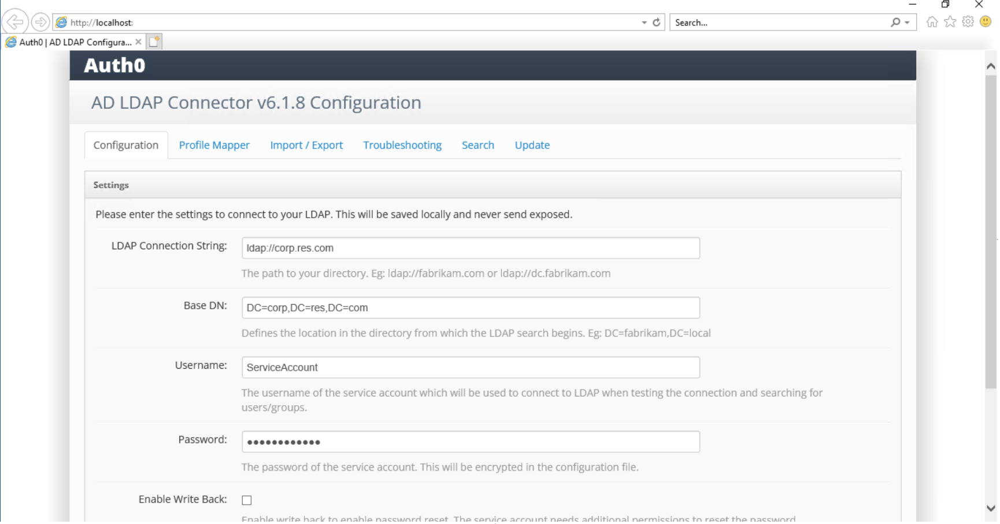

# RES-Auth0
Configuring AWS Research and Engineering Studio with Auth0 for SSO authentication.

# How to configure Auth0 to work with RES

## Summary
Auth0 can integrate with Active Directory via an AD/LDAP connector running on a Windows server that’s domain joined to your AD. A summary of the steps are below:

* Create an Auth0 account, if you do not have one existing.
* Deploy a Windows-based EC2 instance to host the AD/LDAP Connector.
* Create and install the AD/LDAP Connector through Auth0 on the Windows instance.
* Create an Application for Research and Engineering Studio in the Auth0 console.
* Configure your AD/LDAP Connector to use SAML 2.0 to integrate with your RES application.

Note: When you upgrade your environment to a new version of RES, you may have to reconnect the Auth0 integration by replacing URLs (outlined in steps Create an Auth0 Application for RES and onward). You may also need to point DNS records for portal and vdi webpages to any new application or network load balancers.

## 1. Modify Security Group Settings
* Add an inbound security group rule to both your AdDomainWindowsNode and AdDomainAdminNode instances
    * Type: LDAP
    * Source: 0.0.0.0/0
 
## 2. Deploy a Auth0-Connect-Node Instance
* Choose Launch an Instance
    * Name: (ex. Auth0-Connect-Node)
    * AMI: Microsoft Windows Server 2019 Base
    * Instance Type: t2.medium
    * Key Pair: (same key pair that you used to deploy RES)
    * VPC: (change VPC to match that of your RES deployment)
    * Open Advanced Details
        * Domain Join Directory: (join the AD domain used for RES)
        * IAM Instance Profile: AmazonSSMDirectoryServiceInstanceProfileRole (choose a role with AmazonSSMManagedInstanceCore and AmazonSSMDirectoryServiceAccess permissions)
* Add an inbound security group rule on this instance
    * Type: Custom TCP
    * Port: 443
    * Source: 0.0.0.0/0

## 3. Access Auth0-Connect-Node
* Log in to the new Auth0-Connect-Node as an the RES Admin
    * Choose Connect
    * Navigate to the RDP Client tab
    * Choose Connect Using Fleet Manager
    * Choose Fleet Manager Remote Desktop
    * Add the user credentials for your Admin user of RES

## 4. Change Security Settings on Desktop
* Open the Windows Start menu
* Click on Server Manager
* Click Local Server
* Select “On” next to IE Enhanced Security Configuration 
* Select “Off” for both Administrators and Users and Save

## 5. Install Google Chrome (you can continue to use Explorer; however, this process is optimized on Google Chrome)
* Navigate to Internet Explorer and download Google Chrome
    * If Internet Explorer asks about Security Settings, select “Do not use recommended settings”.

## 6. Create an Enterprise Connection in Auth0
* From Internet Explorer or Google Chrome, open Auth0 and log in to your account
* Navigate to Auth0 Dashboard > Authentication > Enterprise and select Active Directory/LDAP
* Select “Create Connection” 
* Enter a Connection Name and optional Display Name (ex. Auth0-AD-Connection)
* Leave the remaining option as default and Save
* From the resulting screen, copy the Provisioning Ticket URL and select “Install for Windows”


## 7. Install and Configure the AD/LDAP Connector
* Download the Auth0 Active Directory/LDAP Connector for Windows (MSI) file - Auth0 Active Directory/LDAP Connector for Windows and open
* When prompted by Windows Defender SmartScreen, select “more info” and then “run anyway”


* Run the installer, leave all options as default, and install
* When prompted, enter the Ticket URL that you copied previously.


* The Windows Installer should prompt you with the screen below with your pre-populated LDAP Connection String and Base DN. PLEASE REMOVE THE IP IN THE LDAP CONNECTION STRING PRIOR TO “corp.res.com” (for example - IP-C12345678)


* Enter ServiceAccount as the username and enter the password to your ServiceAccount.



* Your connection should now show as “Online” in the Auth0 console.

## 8. Create an Auth0 Application for RES
* In the Auth0 console, navigate to the Applications page on the left-hand side
* Click “Create Application” and specifically, Regular Web Application
* Navigate to the Settings tab
    * Change title to Research and Engineering Studio 
    * Application Login URI: Add the domain URL for your RES web app (ex. https://portal.res.alias.people.aws.dev)
    * Allowed Callback URLs: Add your RES SAML Redirect URL
        * Can be found in your RES Web App portal:
            * Tip: If you the additional layer of Auth0 is preventing your from accessing RES, add “/?sso=false” at the end of the URL
            * Log in as Admin or ClusterAdmin
            * Go to the Environment Management tab and then the General Settings page
            * Select the Identity Provider tab and copy your SAML Redirect URL
    * Allowed Logout URLs:
        * Add your Cognito Domain (found in the Cognito console or you can use the Domain URL in RES Identity Provider Tab) and add “/logout”
    * Click Save Changes
* Navigate to the Addons tab
    * Toggle on the SAML2 Web App option
    * Navigate to the Settings tab
    * Replace the Settings code block with the below:

```
{
  "audience": "urn:foo",
  "recipient": "http://foo",
  "mappings": {
    "email": "email"
  },
  "createUpnClaim": true,
  "passthroughClaimsWithNoMapping": true,
  "mapUnknownClaimsAsIs": false,
  "mapIdentities": false,
  "signatureAlgorithm": "rsa-sha1",
  "digestAlgorithm": "sha1",
  "destination": "https://foo",
  "lifetimeInSeconds": 3600,
  "signResponse": false,
  "typedAttributes": true,
  "includeAttributeNameFormat": true,
  "nameIdentifierFormat": "urn:oasis:names:tc:SAML:1.1:nameid-format:unspecified",
  "nameIdentifierProbes": [
    "http://schemas.xmlsoap.org/ws/2005/05/identity/claims/emailaddress"
  ],
  "authnContextClassRef": "urn:oasis:names:tc:SAML:2.0:ac:classes:unspecified",
  "logout": {
    "callback": "http://foo/logout",
    "slo_enabled": true
  },
  "binding": "urn:oasis:names:tc:SAML:2.0:bindings:HTTP-POST"
}
```
Next:
* Please replace the following lines accordingly:
  * Audience: Replace with urn:amazon:cognito:sp:user-pool-id (add your own user-pool-id - this can be found in your RES Web App - login as Admin or ClusterAdmin, navigate to Environment Management → General Settings → Identity Provider)
  * Recipient: Replace with your SAML Redirect URL (this can be found in your RES Web App - login as Admin or ClusterAdmin, navigate to Environment Management → General Settings → Identity Provider)
  * Destination: Add the domain URL for your RES web app (ex. https://portal.res.alias.people.aws.dev)
  * Callback (under logout section): Add your Cognito Domain (found in the Cognito console or you can use the Domain URL in RES Identity Provider Tab) and add “/logout”
  * Click Enable and then Save


* Navigate to the Usage tab 
    * Where you see Identity Provider Metadata, right-click the Download hyperlink and click Copy Link Address


* Navigate to your RES Console and log in as Admin or ClusterAdmin
    * Navigate to Environment Management → General Settings → Identity Provider
    * Under Single Sign-On, select the pencil next to the status and select SAML


    * Change the following details:
        * Provider Name: Enter a provider name like auth0 (keep provider names in lower case)
        * Select “Enter metadata document endpoint URL”: Paste the address copied from the Identity Provider Metadata
        * Provider Email Attribute: Enter "email"
        * Click Submit

* Back in Auth0, navigate to the Connections tab
    * Ensure all Database and Social Connections are toggled OFF and the connection your just created is toggled ON under Enterprise
* Navigate to the AWS Console and to Amazon Cognito
    * Click on your RES User Pool and navigate to the App Integration tab
    * Scroll down to the App Client List and select single-sign-on-client
    * Scroll down to Hosted UI, click Edit, and ensure your provider (ex. auth0) is added as the Identity Provider and the links you added to the application in Auth0 are visible
